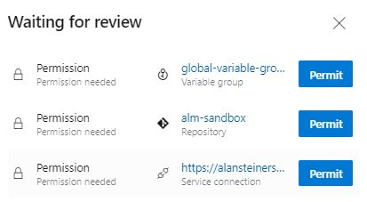

# Maker Setup

To setup a user as an advanced maker the following needs to be done.

1. A Development Environment for the Maker.

    **NOTE:** Makers can use https://web.powerapps.com/community/signup to signup for community developer environment

2. The Azure Active Directory Service service principal in the Developers Maker environment as a System Administrator

```bash
coe aa4am user add -e https://org12345-dev.crm.dynamics.com
```

3. Add a service connection to the developers environment in Azure DevOps

```bash
coe aa4am connection add -e https://org12345-dev.crm.dynamics.com -o https://dev.azure.com/dev12345 -p alm-sandbox
```

4. Run the ALM Accelerator for Advanced Makers application and sign into services

6. Create a branch for the solution. See [Create Solution Branch](#create-solution-branch) for more information

## Create Solution Branch

Each solution will require a solution branch created with Azure DevOps Pipeline with Build Policies for Validation and Continious deployment to test and production environments.

To create a solution branch

1. Log out of any existing sessions if not the maker

```bash
az logout
```

2. Ensure the Application User has access access to the development environment. This step only needs to be completed once

```bash
coe aa4am user add -e https://org12345-dev.crm.dynamics.com
```

3. Create a solution branch

```bash
coe aa4am branch -o https://dev.azure.com/dev12345 -p alm-sandbox -d MyTestSolution
```

NOTE: If the repository you want to create a branch for is empty you will need to commit an initial commit before a branch can be created.

## Post Setup Checks

After setting up an advanced maker you may need to verify the following

1. If this is your first branch created you will need to check variables applied for the the created pipeline

2. The first time that each pipeline is run frm the administration application you will need to open the pipeline in Azure DevOps and approve the resources used by the pipeline.

3. Select the blue icon for the Azure DevOps Build in the application

   

4. Check if is message similar to the following that requires approval of the pipeline to run

   

5. If required select "View" and permit the buidl pipeline to

   

NOTES:
1. If you are using a free Azure Subscription you may receive error "No hosted parallelism has been purchased or granted.". To resolve this issue visit to request Azure Pipeline build compute https://aka.ms/azpipelines-parallelism-request