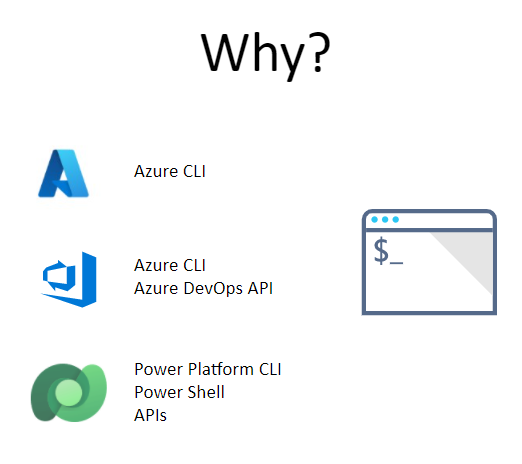
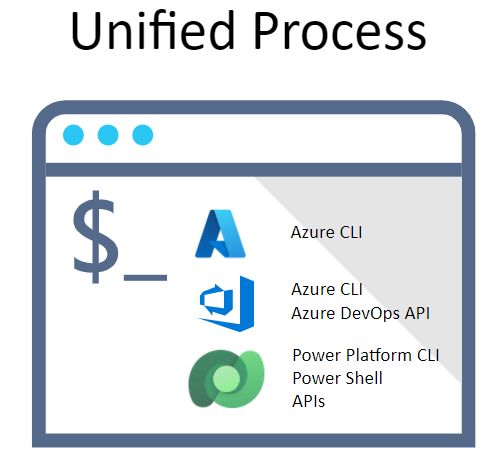

# Overview

Once you have an install of the command line interface and it's [prerequisites](#prerequisites) you can review the following commands

- [Install](./install.md) - How to install the COE CLI.

- [ALM Accelerator for Advanced Makers](./aa4am/readme.md) - Use CLI commands to setup and configure an environment for Advanced Makers to enable them to do more.

## Background



The COE CLI has been design to provide a set of commands that different [personas](./aa4am/personas.md) across the organization can use to automate the process of installing COE components covering Azure, Azure DevOps and the Power Platform. 



The COE CLI wraps existing CLI and APIs so that there is a set of commands that can be used to holistically automate the end to end Microsoft Solution deployment required by COE services. 


## Getting Started

Once installed can use -h argument to see help options

```bash
coe -h
```

Authentication for tasks is managed using the Azure CLI. Using standard az cli commands you can login, logout and select accounts. For example

```bash
az login
coe aa4am install -c add
az logout
```

## Getting Help

You can get short descriptions of any command by adding **--help** to the command line. To get more detailed help you can use the help command. For example to get help on the ALM Accelerator for Advance Makers Help use the command

```
coe help aa4am install
```

Read more in [help](./help/readme.md) pages for detailed description for each command.

## Quick Starts

- [ALM Accelerator for Advanced Makers Quick Start](./aa4am/readme.md#quick-start)

## Read More

Further reading

- [COE CLI Upgrade](./upgrade.md) How to upgrade to a new version of the COE install.